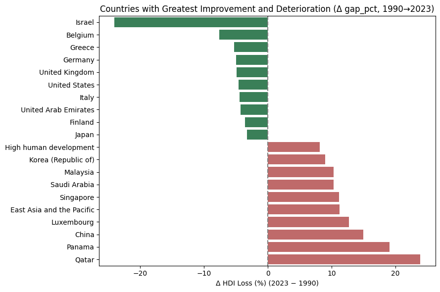

# Impronta ambientale vs sviluppo umano (1990–2023)

### *Chi paga il prezzo più alto?*

Studio in notebook che misura come le **emissioni di CO₂** e il **Material Footprint** riducono l’Indice di Sviluppo Umano (HDI) in 193 Paesi lungo 34 anni.

---

## Anteprima

<p align="center">
  
  
</p>

---

## Struttura del repository

| Percorso                    | Descrizione                                                                                   |
|-----------------------------|-----------------------------------------------------------------------------------------------|
| `WDI_analysis_EN.ipynb`     | Notebook in inglese – preparazione dati, EDA, mappe, trend, quadranti, conclusioni.           |
| `WDI_analysis_IT.ipynb`     | Notebook in italiano – stesso codice, commenti in italiano.                                   |
| `assets/`                   | Anteprime PNG usate in questo README (`heatmap.png`, `improvement.png`, `top10_penalized_countries.png`). |
| `requirements.txt`          | Versioni dei pacchetti Python testate.                                                        |
| `LICENSE`                   | Licenza MIT per codice e notebook.                                                            |

---

## Avvio rapido (locale)

```bash
git clone https://github.com/Francescopetriaggi/WDI-analysis.git
cd WDI-analysis

python -m venv .venv && source .venv/bin/activate    # facoltativo
pip install -r requirements.txt

# ---- Operazione manuale di 1 minuto ----
# Scarica il file CSV WDI (~178 MB) dal World Bank:
# https://datacatalog.worldbank.org/search/dataset/0037712/World-Development-Indicators
# decomprimilo e copia il file *_Data.csv più grande in:
#   data/wdi.csv
# ----------------------------------------

jupyter lab WDI_analysis_EN.ipynb

