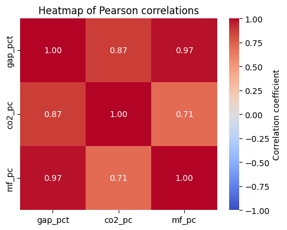
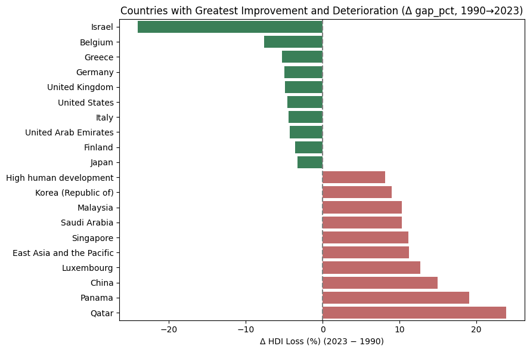

# Environmental Footprint vs Human Development (1990-2023)  
Who pays the highest price?

[](https://mybinder.org/v2/gh/Francescopetriaggi/WDI-analysis/HEAD)

Notebook-based study that quantifies how **CO₂ emissions** and **Material Footprint** erode the Human Development Index (HDI) in 193 countries over 34 years.

---

## Preview

<p align="center">
  
  
</p>

---

## Repository layout

| Path | Description |
|------|-------------|
| `WDI_analysis_EN.ipynb` | English notebook – data prep, EDA, maps, trends, quadrants, conclusions. |
| `WDI_analysis_IT.ipynb` | Italian notebook – same code, Italian commentary. |
| `assets/` | PNG previews used in the README (`heatmap.png`, `improvement.png`, `top10_penalized_countries.png`). |
| `requirements.txt` | Tested Python package versions. |
| `LICENSE` | MIT license for code & notebooks. |

> **Data note** – The original 178 MB CSV is **not stored** in the repo.  
> The notebook downloads it automatically (first cell) from the World Bank.

---

## Quick start

```bash
git clone https://github.com/Francescopetriaggi/WDI-analysis.git
cd WDI-analysis

python -m venv .venv && source .venv/bin/activate    # optional
pip install -r requirements.txt

jupyter lab WDI_analysis_EN.ipyn
